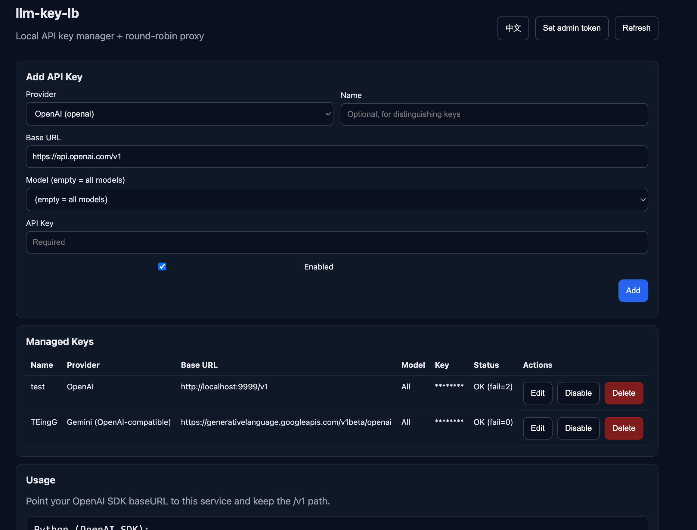

# llm-api-lb

[English](README.md)

`llm-api-lb` 是一个本地运行的 HTTP 网关，用来管理多个上游 API Key，并对外提供一个统一的 OpenAI 兼容 `/v1` 入口。它会对可用 Key 做轮询，并在遇到限流/错误时自动冷却与切换。



## 功能

- 本地管理界面：新增/编辑/启用/禁用/删除 Key
- 更稳的 Key 录入：自动去引号/去掉 `Bearer` 前缀/trim 空白（避免粘贴格式导致鉴权失败）
- 厂商预设：OpenAI、Gemini（OpenAI 兼容）、DeepSeek（OpenAI 兼容）、自定义
- OpenAI 兼容反向代理：自动注入上游 `Authorization: Bearer <apiKey>`
- 负载均衡与故障切换：按 provider+model 分池轮询；遇到 `429`/`5xx`/`401/403` 冷却并重试；全冷却时选择“最早解除冷却”的 Key 继续尝试
- 监控面板：按 Key 统计请求/成功/失败/冷却/平均耗时 + 勾选出图
- Prometheus 指标：暴露 `/metrics`（`llm_api_lb_*`）
- 界面语言切换：中英文

## 应用场景

- 你手上有多个免费/低配 API Key（每个 Key 的 RPM/TPM 很低），希望尽量规避单 Key 频繁触发 `429 Too Many Requests`。
- 你希望业务侧只配置一个 OpenAI 兼容 baseURL，由本服务在多 Key/多厂商之间做路由与切换。
- 你希望有轻量可视化与 Prometheus 指标，但不想上完整网关体系。

## 快速启动

```bash
npm i
npm start
```

默认端口 `8787`：

- 管理界面：http://localhost:8787/
- 健康检查：http://localhost:8787/health
- OpenAI 兼容入口：http://localhost:8787/v1
- Prometheus 指标：http://localhost:8787/metrics

## 配置（环境变量）

可选：把 `.env.example` 复制为 `.env`：

- `PORT`（默认 `8787`）
- `ADMIN_TOKEN`（默认空；设置后会保护 `/admin/*`）
- `DATA_FILE`（默认 `./data/state.json`）
- `METRICS_PATH`（默认 `/metrics`）

## 业务侧如何接入

把你业务里 OpenAI SDK 的 `base_url/baseURL` 指向本服务，并确保路径包含 `/v1`。业务侧 `api_key` 随便填任意非空字符串即可（真正的上游 key 在本服务里配置/管理）。

Python：

```python
from openai import OpenAI
client = OpenAI(api_key="DUMMY", base_url="http://localhost:8787/v1")
```

JS/TS：

```js
import OpenAI from "openai";
const client = new OpenAI({ apiKey: "DUMMY", baseURL: "http://localhost:8787/v1" });
```

### 厂商选择规则

- 默认：根据请求体里的 `model` 前缀推断（`gemini-*` → gemini，`deepseek-*` → deepseek，否则 → openai）
- 覆盖：请求头显式指定 `x-llm-provider: openai|gemini|deepseek|custom`

Gemini 预设使用 Google 官方 OpenAI 兼容 Base URL：
`https://generativelanguage.googleapis.com/v1beta/openai/`

## 监控

### 管理界面

打开 http://localhost:8787/，滚动到“监控”：

- 每个 Key 前面有勾选框；勾选后，下方图表会展示这些 Key 的趋势。
- 图表开关：柱状图（每分钟请求量）、折线（平均耗时）。

### Prometheus 指标

查看原始指标：

```bash
curl -sS http://localhost:8787/metrics | less
```

只看本项目指标：

```bash
curl -sS http://localhost:8787/metrics | grep '^llm_api_lb_'
```

最简 `prometheus.yml` 示例：

```yaml
scrape_configs:
  - job_name: "llm-api-lb"
    static_configs:
      - targets: ["localhost:8787"]
```

### 关键指标与 Grafana 查询

| 指标名称 | 类型 | 说明 | Grafana PromQL 示例 |
| :--- | :--- | :--- | :--- |
| `llm_api_lb_requests_total` | Counter | 请求总数（含状态码、KeyID 标签） | `sum by (key_name) (rate(llm_api_lb_requests_total[1m]))` |
| `llm_api_lb_key_cooldown` | Gauge | 冷却状态（1=冷却中, 0=正常） | `llm_api_lb_key_cooldown` (State timeline) |
| `llm_api_lb_request_duration_seconds` | Histogram | 请求耗时分布 | `histogram_quantile(0.95, sum by (le) (rate(llm_api_lb_request_duration_seconds_bucket[5m])))` |
| `llm_api_lb_in_flight` | Gauge | 当前正在处理的请求数 | `llm_api_lb_in_flight` |

查看错误率最高的 Key：
```promql
topk(5, sum by (key_name) (rate(llm_api_lb_requests_total{status!~"2.."}[5m])) / sum by (key_name) (rate(llm_api_lb_requests_total[5m])))
```

## 构建可执行文件（macOS / Windows / Linux）

本项目使用 `pkg` 生成单文件可执行程序。

macOS：

```bash
npm run build:app:mac
```

Linux：

```bash
npm run build:bin:linux
```

Windows：

```bash
npm run build:bin:win
```

生成物在 `dist/`。状态文件默认写到当前工作目录的 `./data/state.json`（可用 `DATA_FILE` 改）。
macOS 的 `.app` 默认把状态写到：`~/Library/Application Support/llm-api-lb/state.json`。
macOS 安装与首次打开：

- 建议把 `llm-api-lb.app` 拖到“应用程序 /Applications”后再打开（不要在 Downloads 里直接打开，也不要进入 `Contents/` 手动运行）。
- 若提示“无法打开，因为无法验证开发者 / 来自身份不明开发者 / 已阻止”，到“系统设置 → 隐私与安全性”，在底部找到对应提示并点“仍要打开”，再回到应用右键“打开”一次。

macOS 菜单栏（常驻模式）：

- 关闭主窗口不会退出程序；可从右上角菜单栏图标打开主界面。
- 菜单包含：打开主界面、启动、停止、用浏览器打开、退出。

## 安全建议

- 不要提交 `.env` 或任何真实 API Key。
- 如果要对外网开放，请务必先设置 `ADMIN_TOKEN`。
